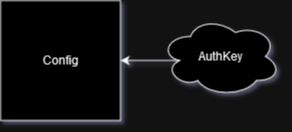

# Config Table



## Summary
This table is how Pogly Standalone is configured. Currently this table can only be configured once, when the instance was first created. The SpacetimeDB module must be fully republished and all data wiped for you to reconfigure the instance. The config table houses the settings for the instance and all clients use this table to determine how to render their Standalone canvas. There is also an AuthKey table which is a private supporting table that allows for things like [Authentication](../use/authentication.md).

## Table Structure
```csharp
[SpacetimeDB.Table(Public = true)]
public partial struct Config
{
    [SpacetimeDB.Column(ColumnAttrs.PrimaryKey)]
    public uint Version;                    // Singleton, always 0, created by the Server onInit

    public Identity OwnerIdentity;          // Identity of instance owner
    public string TwitchChannel;            // Twitch channel for stream preview & 7TV emotes
    public bool DebugMode;                  // Extra logging if enabled
    public uint UpdateHz;                   // Refresh rate of movement
    public uint EditorBorder;               // Depreciated and not used
    public bool Authentication;             // Auth boolean, if true, require users to Authenticate
    public bool StrictMode;                 // StrictMode, if true, require users to have permission entry
    public bool ConfigInit;                 // Config initialization, if false, allow SetConfig()
}

///////////////////////////////////
// _AuthenticationKey Private Table

[SpacetimeDB.Table(Public = false)]
public partial struct _AuthenticationKey
{
    [SpacetimeDB.Column(ColumnAttrs.PrimaryKey)]
    public uint Version;

    public string Key;
}
```

This table structure is mostly locked in, however we make no promises. If you plan on modifying the Pogly Standalone client-side, be sure to check the table-structure hasn't changed, and regenerate the client-side bindings if needed.

The Config table should be a one-stop-shop for all things "global settings" related. Included in this section is also the `_AuthenticationKey` table. Note that the Auth table is set to Private with `[SpacetimeDB.Table(Public = false)]`. Not long ago, this distinction was only created by prefixing your table with an underscore, which is the reason for the name.

If `Config.Authentication` is true, clients will call an Authenticate reducer, which the server will process against the value in the private table. If everything checks out, `Guests.Authenticated` will be set to true. 

## Reducers
Because the Config table is not meant for users to edit, there are very few reducers supporting it.

```csharp
void SetConfig(string twitch, bool debug, uint updateHz, bool authentication, bool strictMode, string authKey="") {}

void Authenticate(string key) {}
```

The `SetConfig` reducer can only be called once, if the `ConfigInit` boolean is set to false. This reducer also sets the `OwnerIdentity` in the config table as well as creates an owner `Permission` entry for that identity as well.

If Authentication is selected, all reducers (aside from Authenticate) will require the Guest's `Authenticated` boolean to be set to true. This means a Guest will have to call `Authenticate()` before being able to interact with the Pogly Instance.

The other settings are fairly self explanatory. TwitchChannel is the string name for the twitch channel associated with the Pogly instance. This allows for a stream preview + utilization of that channels 7TV emotes. UpdateHz determines the client-side rate limiting of the updates to the Pogly standalone module. A higher number results in more calls, at the cost of more data usage. Recommended to stay between 60-120hz. 

The logic within each reducer is fully customizeable and you are more than able to modify and adjust code as needed to suit your specific needs or purpose. There are various helper functions for Authentication and Strict Mode, as you will see when you start diving into the code. 