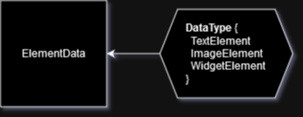

# ElementData Table



## Summary
This table is responsible for holding the definition of what an element is. Without an ElementData, an Element would simply be an empty container with transform properties. If the ElementData is of type `ImageElement`, it will contain the raw image data; whereas if the elementData is of type `WidgetElement`, it will contain the widget code. Some additional information lives here, such as default width/height and who created it.

## Table Structure
```csharp
[SpacetimeDB.Table(Public = true)]
public partial struct ElementData
{
    [SpacetimeDB.Column(ColumnAttrs.PrimaryKeyAuto)]
    public uint Id;                 // PrimaryKey Identifier

    public string Name;             // Name of the Data, to be displayed in sidebar
    public DataType DataType;       // TextElement, ImageElement, WidgetElement
    public string Data;             // Raw data for element- Image=b64 or URL, Widget=widget json
    public int DataWidth;           // Default Width for data
    public int DataHeight;          // Default Height for data
    public string CreatedBy;        // Who created this data
}

// /////////////
// DataType Enum

[SpacetimeDB.Type]
public enum DataType
{
    TextElement,
    ImageElement,
    WidgetElement,
}
```

This table structure is mostly locked in, however we make no promises. If you plan on modifying the Pogly Standalone client-side, be sure to check the table-structure hasn't changed, and regenerate the client-side bindings if needed.

All properties that *define* what an element should be are stored on the ElementData. It's important to make that distinction so that we keep the *state* of something and the *definition* of something separate.

## Reducers
As with all Pogly tables, the ElementsData table will have reducers for adding a new row, updating a row, updating a specific column in a row, or deleting row(s).

```csharp
void AddElementData(string name, DataType type, string data, int width, int height) {}

void UpdateElementData(uint dataId, string name, string data, int width, int height) {}

void UpdateElementDataSize(uint dataId, int width, int height) {}

void UpdateElementDataName(uint dataId, string name) {}

void UpdateElementDataData(uint dataId, string data) {}

void DeleteElementDataById(uint id) {}

void DeleteElementDataByName(string name) {}

void DeleteAllElementData() {}
```

Depending on the Config settings, the sanity checking within each reducer may vary. For example, in [Strict Mode](../use/strictMode.md), every ElementData reducer is restricted, and will reject and return if a user is not a certain permissions level.

The logic within each reducer is fully customizeable and you are more than able to modify and adjust code as needed to suit your specific needs or purpose. There are various helper functions for Authentication and Strict Mode, as you will see when you start diving into the code. 