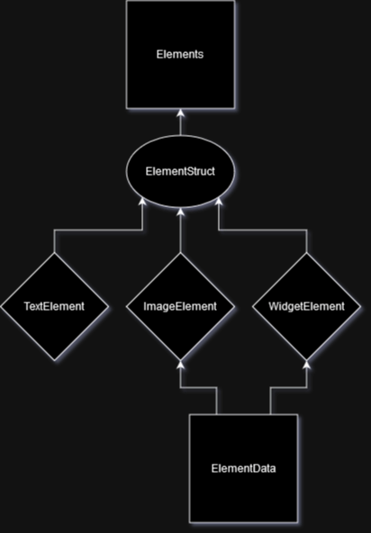

# Elements Table



## Summary
This table is responsible for holding and maintining state of all active elements on the Pogly canvas. When an item is added or deleted on the canvas, it is also inserted or deleted in this table. It houses critical information about the active element, like it's Position, Rotation, Transparency, Size. In addition, an Element can be of type `TextElement`, `ImageElement`, or `WidgetElement`, and can only be of one type at any given time. This type is in the form of an `ElementStruct`. Each of various structs may house specific information relevant to the element type.

## Table Structure
```csharp
[SpacetimeDB.Table(Public = true)]
public partial struct Elements
{
    [SpacetimeDB.Column(ColumnAttrs.PrimaryKeyAuto)]
    public uint Id;                     // PrimaryKey Identifier

    public ElementStruct Element;       // Can be TextElement, ImageElement, or WidgetElement

    public int Transparency;            // Transparency; rendered client-side value range 0-100
    public string Transform;            // CSS Transform; string that contains most CSS properties
    public string Clip;                 // Clipping string; feeds into Transform client-side
    public bool Locked;                 // Locked boolean, true = can't move element

    public string PlacedBy;             // Who placed the element
    public string LastEditedBy;         // Who last interacted with the element

    public int ZIndex;                  // Current ZIndex for the element
}

// //////////////////////////////////////////////////////////////////////////////
// ElementStruct Types -- These can fit into the ElementStruct column in Elements

[SpacetimeDB.Type]
public partial struct TextElement
{
    public string Text;                 // String data for the Text Element
    public int Size;                    // Font size
    public string Color;                // Color
    public string Font;                 // Font string name - must be present on the client
}

[SpacetimeDB.Type]
public partial struct ImageElement
{
    public ImageElementData ImageElementData;   // Tuple type - <uint ElementDataId, string RawData>
    public int Width;                           // Current Width of the Element
    public int Height;                          // Current Height of the Element
}

[SpacetimeDB.Type]
public partial struct WidgetElement
{
    public uint ElementDataId;          // ElementDataId for lookups
    public int Width;                   // Current Width of the Element
    public int Height;                  // Current Height of the Element
    public bool Toggle;                 // Toggle bool used for the Toggle Feature
}
```

This table structure is mostly locked in, however we make no promises. If you plan on modifying the Pogly Standalone client-side, be sure to check the table-structure hasn't changed, and regenerate the client-side bindings if needed.

All properties that an *active* element would need should be on the Elements table or it's associated ElementStruct. It's important to make that distinction so that we keep the *state* of something and the *definition* of something separate.

## Reducers
As with all Pogly tables, the Elements table will have reducers for adding a new row, updating a row, updating a specific column in a row, or deleting row(s).

```csharp
void AddElement(ElementStruct element, int transparency, string transform, string clip) {}

void UpdateElement(uint elementId, ElementStruct element, int transparency, string transform, string clip, bool locked) {}

void UpdateElementStruct(uint elementId, ElementStruct elementStruct) {}

void UpdateElementTransparency(uint elementId, int transparency) {}

void UpdateElementTransform(uint elementId, string transform) {}

void UpdateElementClip(uint elementId, string clip) {}

void UpdateElementLocked(uint elementId, bool locked) {}

void DeleteElement(uint elementId) {}

void DeleteAllElements() {}
```

Depending on the Config settings, the sanity checking within each reducer may vary. For example, in [Strict Mode](../use/strictMode.md), AddElement, UpdateElement & UpdateElementStruct will reject and retun when called if a user does not meet a specific permissions level. 

The logic within each reducer is fully customizeable and you are more than able to modify and adjust code as needed to suit your specific needs or purpose. There are various helper functions for Authentication and Strict Mode, as you will see when you start diving into the code. 