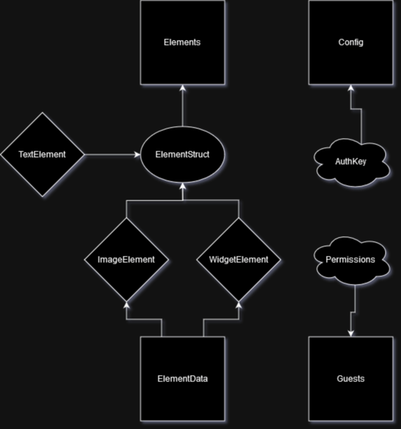

# Developing in Pogly Standalone

Welcome to the WIP developer documentation for Pogly Standalone. 

Currently, only the SpacetimeDB module is documented. The React/Typescript frontend is still very much WIP and thus we are holding off on creating documentation for it. (Feel free to play around with it though!)

## SpacetimeDB

Pogly utilizes a fresh new relational database system that also acts as the server, called [SpacetimeDB](https://spacetimedb.com/?referral=Lethalchip). Before attempting to develop in Pogly, it's highly recommended that you understand the fundamentals of SpacetimeDB, specifically:

 - SpacetimeDB [C# Module documentation](https://spacetimedb.com/docs/modules/c-sharp)
 - SpacetimeDB [Typescript client SDK documentation](https://spacetimedb.com/docs/sdks/typescript)
 - [SpacetimeDB Elevator Pitch](https://www.youtube.com/watch?v=z3N7UULrRSA)

 A quick tl;dr on SpacetimeDB from Chippy:

 > It's like writing a database-less server. You declare your tables in code once, and then write *Reducers* which are basically just fancy methods that clients can call. You put all your server code inside these reducers, sanity checking input from clients and making inserts/updates/deletes to your database tables with an insanely simple to use auto-generated methods. You don't have to worry about making shared libraries for server/client because SpacetimeDB generates a client SDK in almost every relevant langauge automagically for you. 

 ## Pogly Core Concepts

Pogly's module language of choice is C#, however you can rebuild the module in whatever language you'd like that is currently supported by SpacetimeDB. The client SDK's generated from C# module code or Rust module code are the same. 

The database structure for Pogly is simple, though does have some small complexities.

The four main tables as listed in the *very basic* diagram above are:

 - [Elements](./elements.md)
 - [ElementData](./elementData.md)
 - [Guests](./guests.md)
 - [Config](./config.md)

Each table has a documentation page, hyperlinked above, describing the table, it's complexities, and what it's responsible for. To summarize: 

### Elements
The [Elements table](./elements.md) is responsible for holding and maintining state of all active elements on the Pogly canvas. When an item is added or deleted on the canvas, it is also inserted or deleted in the Elements table. The elements table houses critical information about the active element, like it's Position, Rotation, Transparency, Size. In addition, an Element can be of type `TextElement`, `ImageElement`, or `WidgetElement`, and can only be of one type at any given time. This type is in the form of an `ElementStruct`. Each of various structs may house specific information relevant to the element type.

### ElementData
The [ElementData table](./elementData.md) is responsible for holding the definition of what an element is. Without an elementData, an element would simply be an empty container with transform properties. If the elementData is of type `ImageElement`, it will contain the raw image data; whereas if the elementData is of type `WidgetElement`, it will contain the widget code. Some additional information lives here, such as default width/height and who created it.

### Guests
The [Guests table](./guests.md) is how Pogly Standalone keeps tracks of currently connected users. There are no permanent guest records, or user accounts in Pogly Standalone. Instead, Pogly Standalone relies on a SpacetimeDB concept, [Identity](https://spacetimedb.com/docs#identities). While a guest may use the same token and connect with the same identity, they will be inserted into the guest table as a new guest every time. Pogly Standalone has some localStorage functionality to smooth this out. There is also a Permissions table, which is a supporting table that provides some permissions functionality for things like [Strict Mode](../use/strictMode.md).

### Config
The [Config table](./config.md) is how Pogly Standalone is configured. Currently this table can only be configured once, when the instance was first created. The SpacetimeDB module must be fully republished and all data wiped for you to reconfigure the instance. The config table houses the settings for the instance and all clients use this table to determine how to render their Standalone canvas. There is also an AuthKey table which is a private supporting table that allows for things like [Authentication](../use/authentication.md).

## License

Pogly Standalone is licensed under the Apache-2.0 license.

The Apache-2.0 license is a permissive free software license written by the Apache Software Foundation. It allows you to use Pogly Standalone for any purpose, including your right to distribute it, modify it, distribute modified versions of it (so long as those versions follow the terms of the license), without any concern for royalties.