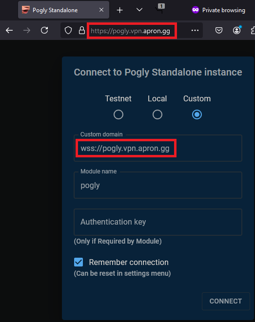

# Docker
## About
Pogly provides a self-contained Docker image that you can spin up with minimal effort.

## Installation
1. Install [Docker](https://docs.docker.com/engine/install/)
2. Choose one of the below two installation methods. If you don't know which to choose, use the docker run command.
3. See [Usage](#usage)

## Docker Run
Example docker run command:
```bash
docker run -p 80:80 -v pogly-keys:/etc/spacetimedb -v pogly-data:/stdb ghcr.io/poglyapp/pogly:main
```

## Docker Compose
Example compose file:
```yaml
services:
  pogly:
    image: ghcr.io/poglyapp/pogly
    restart: always
    ports:
      - 80:80/tcp
    volumes:
      - pogly-keys:/etc/spacetimedb
      - pogly-data:/stdb
    # Optional, if you'd like multiple modules you can specify the names here, space seperated
    # environment:
    #   MODULES: "pogly module2 module3"
volumes:
  pogly-keys:
  pogly-data:
```

## Usage
Once the container is running you can visit http://localhost in your browser. Select **Custom** and input the following:
- Custom domain: `ws://localhost`
- Module name: `pogly`

Once connected, proceed with [first time setup](/use/firstTimeSetup.md).

## Multiple modules
If you'd like to host multiple modules on the same container just add an environment variable called `MODULES` and set your module names seperated by spaces.

You can add more modules at any time, they will be added on container restart.

Note: removing modules from this variable will NOT delete them.

## Reverse Proxying
The container can also be reverse proxied without issue. The custom domain for the example below would be `wss://pogly.example.com`.
```caddyfile
https://pogly.example.com {
    reverse_proxy pogly:80
}
```

The custom domain entry will always be whatever address you visit the page with. See the image below for an example of a custom domain.




