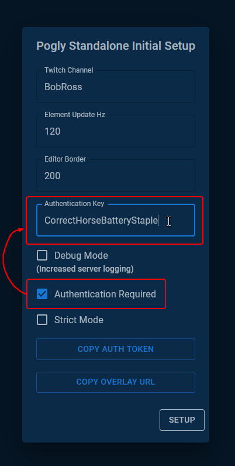
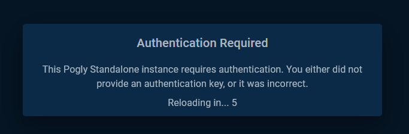

# Authentication

## Summary
This setting is set during the [first time setup](./firstTimeSetup.md) of a Pogly Standalone instance. It allows the instance owner to password protect the entire instance with an Authentication Key.
## Details
If enabled, the Pogly canvas will refuse to render and Guests will not be able to make changes to your Pogly Standalone instance.

While protecting your instance with an authentication key is a great start, it's not foolproof. What if the key gets leaked? This is where [Strict Mode](./strictMode.md) can help, adding additional permissions and only allowing users to create new images if you give them permission.

## Developer Details
SpacetimeDB does not currently have Row-Level Security (RLS). This means that anyone can call the HTTPS or Websocket API's and read the schema and public tables of your instance, even when Authentication is enabled. RLS is a planned feature for SpacetimeDB however is not planned for implementation until Q1 2025.

While database reads are possible, enabling Authentication mode prevents an unauthenticated reducer from calling reducers. **ALL** reducers, except the `Authenticate()` reducer require a Guest to be authenticated if Authentication mode is enabled.