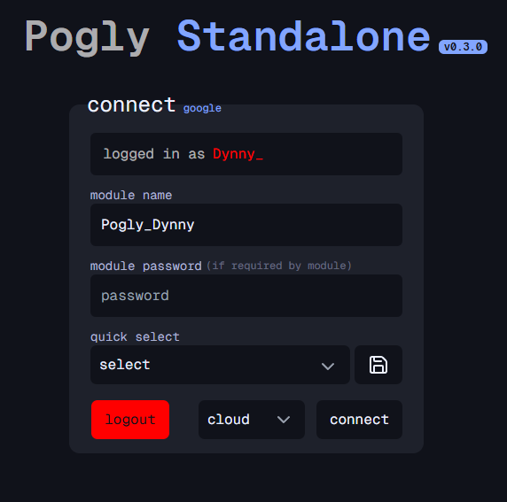

# Pogly beginner's guide

This is an in depth guide on Pogly usage and should contain everything you need to know when starting to use Pogly.

Note: This guide assumes you're using modules hosted by Pogly. Some steps may vary for self-hosters.

## Table of Contents

- [Pogly beginner's guide](#pogly-beginners-guide)
  - [Creating your first module](#creating-your-first-module)
  - [Connecting to your module](#connecting-to-your-module)
  - [Module onboarding](#module-onboarding)
  - [Setting up the overlay](#setting-up-the-overlay)
  - [Navigating the canvas](#setting-up-the-overlay)
  - [Making sure everything works](#navigating-the-canvas)
  - [Adding new editors to your module](#adding-new-editors-to-your-module)
  - [Adding custom elements](#adding-custom-elements)
  - [Layouts](#layouts)
  - [Modifying module settings](#modifying-module-settings)
  - [Keybinds](#keybinds)
  - [Still need help?](#still-need-help)

## Creating your first module

At the moment, Pogly is <b>free to use</b> and you can create as many modules as you want. While in theory you could use one module for multiple streamers, it's recommended to have one module per streamer for performance reasons.

To create a module, join [Pogly Discord](https://discord.gg/pogly). In any public channel, run the `/publish` <b>slash command</b>. Give your module a name. This name is used to connect to your module.

## Connecting to your module

Once you've successfully created your module, in your browser of choice open https://cloud.pogly.gg. You'll be prompted to authenticate using `SpacetimeAuth` which is our [OIDC provider](https://openid.net/developers/how-connect-works/). If you'd like to know more about how we utilize `SpacetimeAuth` and what information we get from you, you can read our [authentication documentation](./authentication.md). Once authenticated, input the name of the module you just created into `module name` input field and press `connect`.

## Module onboarding

When you connect to your module for the first time, you will be prompted to do a 5 step onboarding. This is used to setup your module with various different settings. <b>These settings can be modified later in the settings menu</b>.

<b>The user who finishes the onboarding will be made the owner, ownership CANNOT be transferred.</b>

1. Welcome
   - Welcome screen with basic information as mentioned here.
2. Platform
   - Select which streaming platform your stream is in. This is only used to show a preview stream at the center of the canvas and to fetch channel emotes from 7TV/BTTV.
3. Channel
   - The channel name as shown on the streaming platform.
   - Youtube streamers need to input their Youtube <b>Channel ID!</b>
4. Editors
   - Here you can whitelist other users to use your module. **Users need to be manually whitelisted for them to be allowed to connect to your module!** Find more information below! ([Adding new editors to your module](#adding-new-editors-to-your-module))
5. Finish
   - Explanation on what to do next.

## Setting up the overlay

Once you've finished the onboarding, you can setup the overlay in your streaming tool of choice.

Create a new `Browser source` and fill the following settings:

1. Set browser source URL as follows. <b>Change `YOUR_MODULE_NAME_HERE` with your module name.</b>
   - https://cloud.pogly.gg/canvas?module=YOUR_MODULE_NAME_HERE
2. Set width to `1920`.

3) Set height to `1080`.

**NOTE:** If you stream in higher resolution, **the browser source size still needs to be 1920x1080!** Once you've finished creating the source, **stretch the source to cover the screen!**

## Navigating the canvas

You can navigate on the canvas by holding down **scroll wheel / mouse 3** or using the **WASD** keys.

## Making sure everything works

Once you've finished module onboarding and created your browser source, you can test and make sure everything works by spawning an element from the editor left-hand side and dragging the element on top of the preview stream. <b>You do not need to be live to test it.</b>

## Adding new editors to your module

You were prompted to optionally add new editors to your module during onboarding. If you didn't add any editors at the time or wish to add more now, you can do so by navigating to **settings -> editors**. To add a new editor, simply write their username into the **username** field under **add editor** section. Select the platform the user is from. **This platform needs to be the platform the user uses to authenticate to Pogly!!**

If you wish to learn more about permissions and roles, please read the [in depth permissions documentation](https://github.com/PoglyApp/pogly-documentation/blob/main/use/permissions.md)!

## Adding custom elements

Pogly supports 2 different types of custom elements: [images](./imageElement.md) and [widgets](./widgetElement.md). To upload a new images to your module, open the `Images` category and press `Add image`.

<b>IMPORTANT!</b> Pogly currently supports uploading of images through 2 different means, by file and by URL. We <b>HIGHLY</b> recommend you upload images using URL instead of file as uploading them as files <b>will increase your module's load times SIGNIFICANTLY</b>. We also recommend deleting images you don't frequently use anymore by right clicking it in the menu and pressing delete.

Your module comes with various different widgets. As the widget system can be pretty complex and hard to understand unless you're into programming, we recommend you read the [widget documentation](./widgetElement.md). Here is a very quick rundown for basic widget usage:

Most widgets are configured using widget variables. It is recommended to first spawn the widget and then editing the variables so the changes do not get saved in the base widget element. Spawn your desired widget and double click it in the canvas. A widget editor modal will appear and you can see the customizable variable the widget developer has added which allow you to do specific modifications without actually editing any of the code. 99% of the time these are the only things you need to edit to use the widget, unless you specifically want to modify the widget functionality.

Using the `Youtube Player` widget as an example, the first 2 variables are `video_id` and `volume`. To play a Youtube video, copy paste a Youtube video URL into `video_id` and modify `volume` to your desired value. Once done, press `Save` to close the widget editor. If a widget needs to be activated, you can easily activate it by right clicking the element in the canvas and selecting `Toggles` then the action you want to perform. In this case it would be `play/pause`.

You can find more community made widgets in [Pogly Discord](https://discord.gg/pogly) under `widget-share` channel. To import new widgets, copy the widget code from the thread, press `Add Widget` in widgets category, press `Import` and copy the code from Discord into the input field.

## Layouts

Layouts are a way for you to keep your module clean by splitting your content into their own "scenes". Layouts are a powerful tool and we recommend you read the in depth [layouts documentation](./layouts.md) to learn how to fully utilize them.

## Modifying module settings

If for whatever reason you need to modify the settings you set during module onboarding, you can find them in `Settings` -> `Owner` tab. Here you can also find the moderator list in case you need to remove a moderator while they're not connected. Currently the list does not show their username but this will be updated very soon.

## Keybinds

Pogly has a lot of keybinds for various different actions. Unfortunately we do not currently display these hotkeys inside the app but this will change very soon.

[Find all keybinds here](./userInput.md)

You can more easily and faster upload new images by drag and dropping it over the element selection menu. This automatically fills the upload modal fields and if your image name is proper, all you have to do is press upload!

You can also copy paste images or text directly on to the canvas, without the need to upload them first.

## Still need help?

You can ask help with anything in our [Discord](https://discord.gg/pogly). We are more than happy to help you if you run into any issues!
