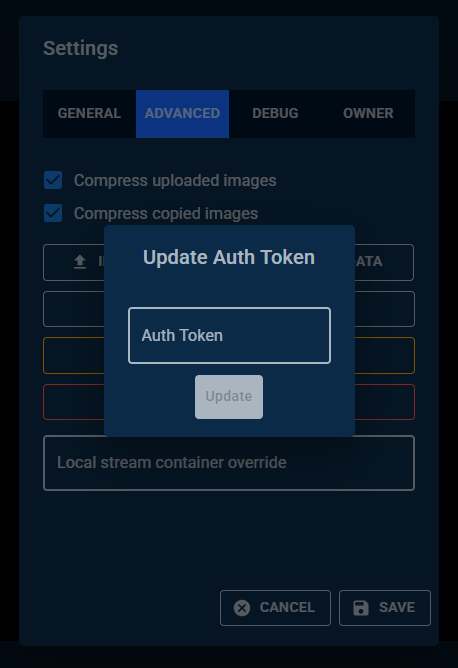

# First Time Setup

# [OUTDATED] Read [Pogly beginner's guide](./beginnerGuide.md) instead!!!

## Connecting to your Pogly module for the first time

First you must select where you module is hosted.

- `Cloud` => If module was created by our Discord bot.
- `Local` => If you are running SpacetimeDB locally and have published your module there.
- `Custom` => If you have SpacetimeDB running on a separate VPS.

Next, you must enter your module name into the `Module name` field. Since you have not yet done the initial setup, you don't have to worry about `Authentication key`.

**OPTIONAL**: Check `Remember connection` to automatically connect to the module without the need to fill in module name and authentication key.

## Configuration

When connecting to a Pogly module for the first time, you will be prompted with an initial setup form. This is used to set basic settings for your module but they can later be modified from settings after connecting to the module.

**NOTE:** The person who finishes this setup will be marked as the **owner**. Ownership cannot be transferred without wipining/resetting the entire module!

- Channel name => Name of the channel this module will be used for.
  - This is only for the stream preview found at the center of the canvas.
- [Element Update Hz](./refreshRate.md) => The rate at which clients push update to the server. Higher means faster but more data.
- Debug Mode => If enabled, will log every reducer state change. Vastly increases storage consumption.
- [Authentication Mode](./authentication.md) => If enabled, guests will have to provide the specified key in order to connect.
- [Strict Mode](./strictMode.md) => If enabled, requires guests to have permissions to create new canvas elements.

Your identity is **stored in your browser's local storage**. If you change browsers or clear your browser history, **you will lose your identity and cannot get it back**.

Click the `COPY AUTH TOKEN` button and copy paste your token somewhere safe on your computer for safe keeping. You can also copy the overlay URL from there but isn't really necessary.

Once you've set everything up, simply click `Setup` and you're off to the races!

## OBS / Streamlabs Browser Source

To utilize Pogly in your stream, you will have to make a browser source in your OBS/Streamlabs.

- URL => Paste the `Overlay URL` here from the initial setup.
  - If you didn't copy the URL: https://standalone.pogly.gg/canvas?module=YOUR_MODULE_NAME_HERE
- Width => `1920`
- Height => `1080`

**NOTE:** If you stream in higher resolution, **the browser source size still needs to be 1920x1080!** Once you've finished creating the source, **stretch the source to cover the screen!**

## Important!

As mentioned above, your identity is stored in your browser local storage which means you can easily lose it. The ownership of the module is tied to that identity and if you lose it, you cannot get your ownership back without resetting the module.

If you saved your token and later your browser history clears and you can no longer connect using the ownership identity, this is how you can reconnect using the saved authentication token.

Connect to your module normally and open settings menu. Under `ADVANCED` you can find `UPDATE AUTH TOKEN` button. Click it and you will be prompted with an input field. Copy paste **the token you saved locally somewhere else** into that field and press `Update`.

Refresh the page and you should now reconnect with the identity that has ownership of the module.

