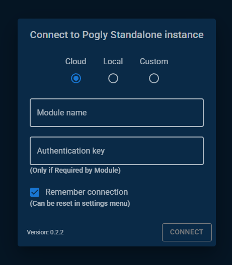
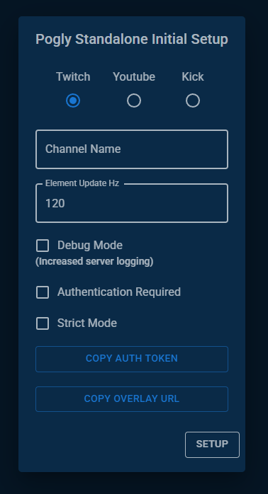
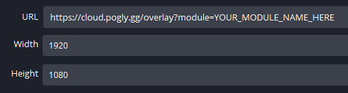

# First Time Setup
## Getting Connected
Before you even begin the first time setup, you have to connect to your Pogly Standalone instance. Depending on how you installed, and what choices you made for hosting, this may vary.



Fill out the connection dialog with whatever information is pertinent to your installation. For example, if you are self-hosting, you would select `Local` and fill in your module name; whereas if you are using SpacetimeDB's test environment, you would select `Testnet` and fill out the module name.

For first time setup the `Authentication Key` is not required.

## Configuration
If this is the first time you've connected to your Pogly Standalone instance, you will be prompted to fill out a configuration dialog.



- Twitch Channel => Your twitch stream name here. Example: BobRoss
- [Element Update Hz](./refreshRate.md) => The rate at which clients push update to the server. Higher means faster but more data.
- ~~Editor Border => Used to determine spacing around the stream preview on the canvas, depreciated.~~
- Debug Mode => If enabled, will log every reducer state change. Vastly increases storage consumption.
- [Authentication Mode](./authentication.md) => If enabled, guests will have to provide the specified key in order to connect.
- [Strict Mode](./strictMode.md) => If enabled, requires guests to have permissions to create new canvas elements.

Make sure to click the `COPY AUTH TOKEN` and `COPY OVERLAY URL` buttons, saving the data to a file somewhere safe.

Once you've set everything up, simply click `Setup` and you're off to the races!

## OBS / Streamlabs Browser Source
To utilize Pogly in your stream, you will have to make a browser source in your OBS/Streamlabs. 

- URL => Paste the `Overlay URL` here from the first time setup
- Width => 1920 (1920 is required, if you want to adjust size, scale it after adding the browser source)
- Height => 1080 (1080 is required, if you want to adjust size, scale it after adding the browser source)
- Custom CSS => `body, html { background-color: rgba(0, 0, 0, 0); margin: 0px auto; overflow: hidden; }`



## Important!
Make sure to copy your `Auth Token` and save this somewhere on your computer. If your browser's localStorage get's deleted, you will no longer be saved as the Owner and will need your auth token to redo your authentication via the settings.

The auth token begins with `ey` and will look something like this: 
```
eyXXXXXXXXXXXXXXXXXXXXXXXXXXXXXXXXXX.eyXXXXXXXXXXXXXXXXXXXXXXXXXXXXXXXXXXXXXXXXXXXXXXXXXXXXXXXXXXXXXXXXXXXXXXXXXXXXXXXXXXXXXXXXXXXXXXXXXXXXXXXXXXXXXXXXXXXXXXXXXXXXXXXXXXXXXXXXXXXXXXXXXX.XXXXXXXXXXXXXXXXXXXXXXXXXXXXXXXXXXXXXXXXXXXXXXXXXXXXXXXXXXXXXXXXXXXXXXXXXXXXXXXXXXXXXX
```

To reimport an auth token, use the "Update Auth Token" button in settings.


