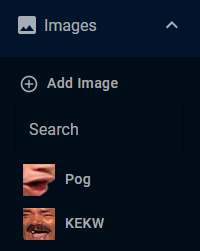
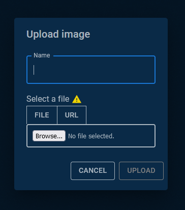

# Image Element 
## Summary
The Image Element is one of the core canvas elements in Pogly. Currently, image elements are created by file upload, or by URL. 

## Details
Adding a new image element is very straight forward. The leftmost menu in Pogly is called the Element Selection Menu. In this menu, you will see the "Images" dropdown menu.

Clicking "Add Image" will result in a new modal appearing, allowing you to upload an image of your choosing, or provide a URL to an image on the internet. 

Once uploaded, the image will be in the "Images" dropdown menu, where you can click it to spawn the Image Element on the canvas.

## Developer Details
Adding new images adds them to the ElementData table. When the Element Selection Menu is loaded, it pulls all ElementData records of type ImageElement and displays them under the "Images" dropdown. 

When you click an image under the dropdown, it creates a new Element of type Image Element that references the stored Element Data.