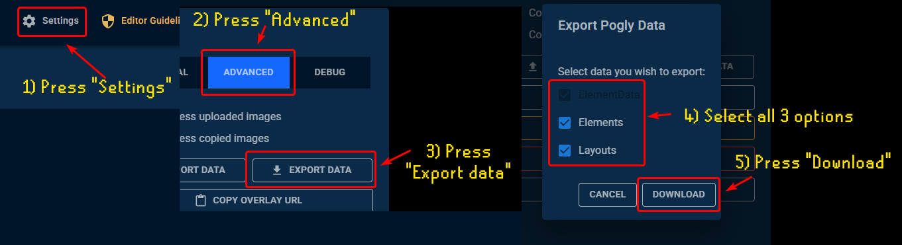
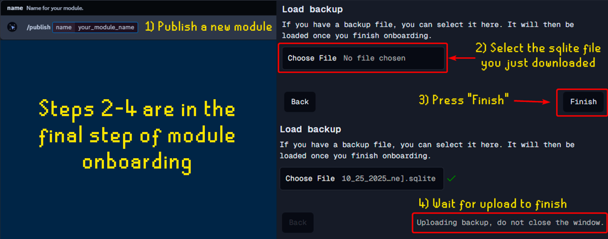

# Pogly 0.3.0 Migration Guide

This guide walks you through migrating from **Pogly 0.2.2** to **Pogly 0.3.0**.  
The same steps apply to any future migrations as well.

> **Need help?**  
> If you run into _any_ issues or have questions, please reach out in [our Discord](https://discord.gg/pogly), we’re happy to help!

## TL;DR (Quick Steps)

(Scroll down for detailed instructions or a video walkthrough)

1. Go to **[https://standalone.pogly.gg](https://standalone.pogly.gg)** and connect to your **old module**.
2. Click **Settings → Advanced → Export Data**.
3. Select **all three** options and click **Download**.
4. In [Pogly Discord](https://discord.gg/pogly), run the `/publish` command again.
   - You can reuse your old module name or choose a new one.
5. Visit **[https://cloud.pogly.gg](https://cloud.pogly.gg)** and log in with **Twitch**, **Kick**, or **Google**.
6. Connect to your **new module** and reach final step of onboarding.
7. Select your sqlite file under **Load backup** and click **Finish** and wait for the upload to finish.
   - **NOTE**: Depending on your module size, this could take some time. **DO NOT CLOSE THE WINDOW!**
8. Update your **browser source** in your streaming software:
   - Change `standalone` → `cloud` in the URL.
   - If you renamed your module, update `?module=OLD_NAME` → `?module=NEW_NAME`.

🎉Your module should now look **exactly the same** as before!

## Video Walkthrough

_(Coming soon!)_

## Exporting Your Data (from 0.2.2)

First, export your data from the older Pogly version:

1. Go to **[https://standalone.pogly.gg](https://standalone.pogly.gg)** and connect to your module.
2. At the top, open **Settings → Advanced → Export Data**.
3. In the export menu, select all three options:
   - `ElementData`
   - `Elements`
   - `Layout`
4. Click **Download** to save the `.sqlite` file to your computer.

## Importing Your Data (to 0.3.0)

1. In [Pogly Discord](https://discord.gg/pogly), run the `/publish` command to create your **new module**.
   - You can reuse your old name or pick a new one.
2. Visit **[https://cloud.pogly.gg](https://cloud.pogly.gg)** and sign in with **Twitch**, **Kick**, or **Google**.
3. Connect to your **new module** and finish onboarding **until the final step**.
4. Before pressing **Finish**, select the sqlite file you just downloaded under **Load backup**.
5. Once the backup is selected and you see a green checkmark, press **Finish**.
6. Wait for upload to finish and the page to refresh
   - **NOTE**: Depending on your module size, this could take some time. **DO NOT CLOSE THE WINDOW!**

🎉 Your new module should now look identical to your old setup!

## Updating Your Browser Source

Since the subdomain has changed, you’ll need to update your browser source URL in your streaming tool:

- Change `standalone` → `cloud` in the URL.
- If you renamed your module, update `?module=OLD_NAME` → `?module=NEW_NAME`.

## What Happens to the Old Module?

You can leave your **old module** as it is, it will be automatically removed in the future.  
If you’d like, you can continue using it temporarily, but we recommend migrating as soon as possible.
