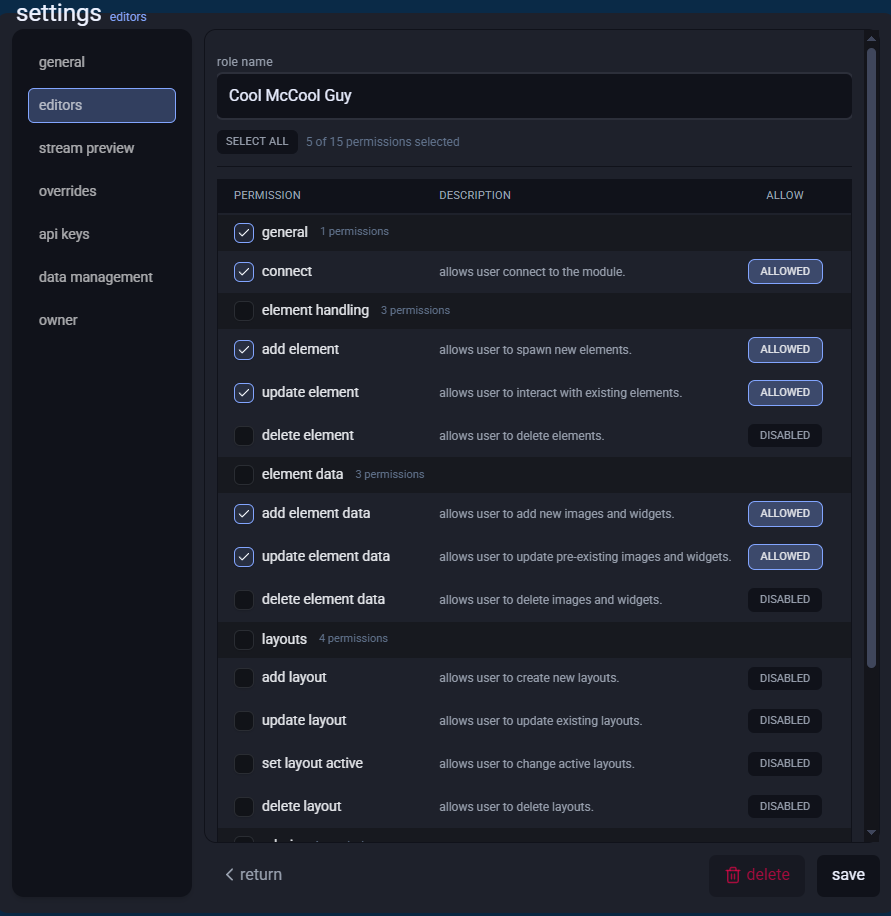
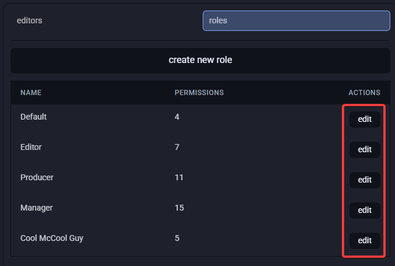
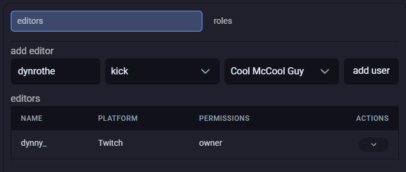
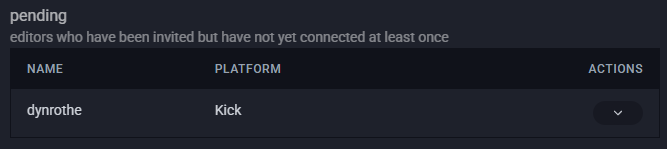
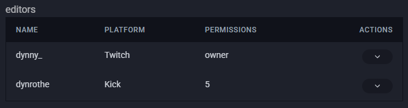
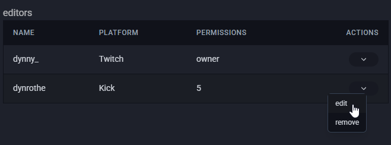

# Permissions

Pogly utilizes a whitelist system to prevent unauthorized access, plus a granular permissions system to
fine tune who can do what.

Every module comes built in with 4 different preset roles that you can utilize during the onboarding flow if you decide to whitelist users during it.

# Default permission roles

- Default
  - Allowed to connect
  - Allowed to add new elements
  - Allowed to move elements
  - Allowed to delete elements
- Editor
  - (default permissions)
  - Allowed to add new images and widgets
  - Allowed to update images and widgets
  - Allowed to delete e lements and widgets
- Producer
  - (default and editor permissions)
  - Allowed to add new layouts
  - Allowed to update layouts
  - Allowed to set layouts as active
  - Allowed to delete layouts
- Manager
  - Has all permissions, rivaling module owner minus owner specific permissions

# Adding new roles

You can add your own custom roles by opening **settings -> editors** and opening the **roles** tab and pressing **create new role** button.

Here you can give your new role a name and select the desired permissions you wish the role to have. Once you've selected everything you want, just press **save**.

If you ever wish to edit the permissions of pre-existing roles (Even default ones), you can press **edit** button in the role row in the **roles** tab

# Whitelisting new editors

Like mentioned above, in order for anyone to connect to your module, they must be whitelisted by someone with the permissions to whitelist. You can whitelist users by opening **settings -> editors**. In the **editors** tab, you can find **add editor** section. To whitelist a user, write down their username in the **username** field and select which platform the user is in. **This means if the person you wish to grant access to authenticates to Pogly using Twitch, the platform needs to be Twitch**.

Once you've whitelisted a user, they will appear under the **pending** section. Pending section is a list of users who have been whitelisted but have not yet connected to your module. At this stage, you can still revoke the whitelist if you so wish.

When the user connects to the module for the first time, they are granted permissions based on the role you assigned to them and they will now appear in the **editors** section.

# Updating individual editor's permissions

If you wish to modify specific user's permissions, you can do so by clicking the arrow button under **actions** in the editors list and pressing **edit**. Then you can manually select and deselect permissions you wish the user to have.

# Disabling access for an editor to the module
You can either remove the **connect** permission directly from the user, which will leave them into the module but they will be unable to connect to the module or you can remove user from accessing your module by simply clicking the arrow button under **actions** and pressing **remove**.
