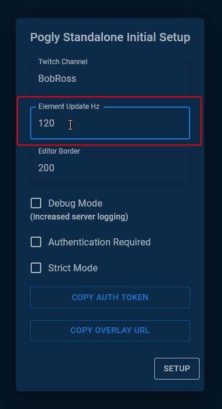

# Element Update Hz

## Summary
This setting is set during the [first time setup](./firstTimeSetup.md) of a Pogly Standalone instance. It allows the instance owner to configure how many times a second the clients will report updated position data to the server.

## Details
It's recommended to keep this value between 60-120hz. Think of it like FPS in a game, generally you want above 60fps, but anything past 120fps isn't really noticeable. With Pogly, you start seeing diminishing returns after around 90hz, with 120hz being roughly as fast as your browser can update.

If you are on limited bandwidth connections, or would like to support users who are in lower speed areas, consider 60-90hz.

## Developer Details
Pogly Standalone does not operate on a Tick basis. SpacetimeDB can handle as many updates per second as you can feasibly send and processes it in order.

The rate limiting set in the configuration is strictly client-sided. It limits how fast clients *send* updates to the server, thereby limiting the amount of updates client *receive* as well. 