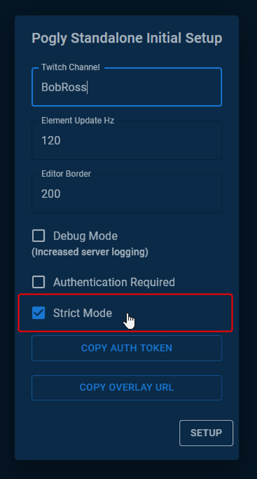
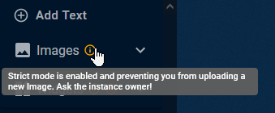

# Strict Mode

## Summary
This setting is set during the [first time setup](./firstTimeSetup.md) of a Pogly Standalone instance. It allows the instance owner to enable restrictions on who is allowed to create new Elements. 

It's generally advised to enable [Authentication](./authentication.md) in addition to Strict Mode to ensure a safe Pogly Standalone experience, however both settings are optional and not required.

## Details
Strict Mode *does not* prevent users from using existing canvas elements, but it *does* prevent them from creating new canvas elements. Only users with the `Moderator` or `Owner` permission will be allowed to create new Elements.

When Guests are connected, they appear in the top right corner of the screen, called the Guest List. You can right click the Guest List to get information about the connected guest, and if you are the instance owner, you can grant/revoke `Moderator` permission.


In addition to being unable to create new canvas elements, users the proper permission will see a warning when Strict Mode is enabled.



## Developer Details
Strict Mode adds an extra sanity check to the following reducers, and will reject/return if the Guest does not have the specific Permission level. 

```csharp
// ElementData
void AddElementData(string name, DataType type, string data, int width, int height) {}
void UpdateElementData(uint dataId, string name, string data, int width, int height) {}
void UpdateElementDataData(uint dataId, string data) {}
void DeleteElementDataById(uint id) {}
void DeleteElementDataByName(string name) {}
void DeleteAllElementData() {}

// Elements -- Only if RawData is used within ElementStruct
void AddElement(ElementStruct element, int transparency, string transform, string clip) {}
void UpdateElement(uint elementId, ElementStruct element, int transparency, string transform, string clip, bool locked) {}
void UpdateElementStruct(uint elementId, ElementStruct elementStruct) {}
```