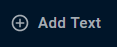
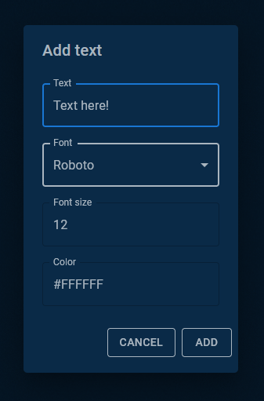

# Text Element

## Summary
The Text Element is one of the core canvas elements in Pogly. Currently, it supports only basic properties:
- Text
- Font
- Font Size
- Font Color
## Details
Adding a new text element is very straight forward. The leftmost menu in Pogly is called the Element Selection Menu. In this menu, you will see "Add Text".

Clicking that will result in a new modal appearing, allowing you to configure the text prior to adding it to the canvas as a text element.

## Developer Details
Text Elements are created without the use of an ElementData record. The entirety of the Text Element lives within the Element and ElementStruct.TextElement.

As such, text elements can be created by users without permissions during [Strict Mode](./strictMode.md).