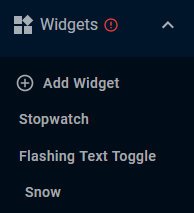
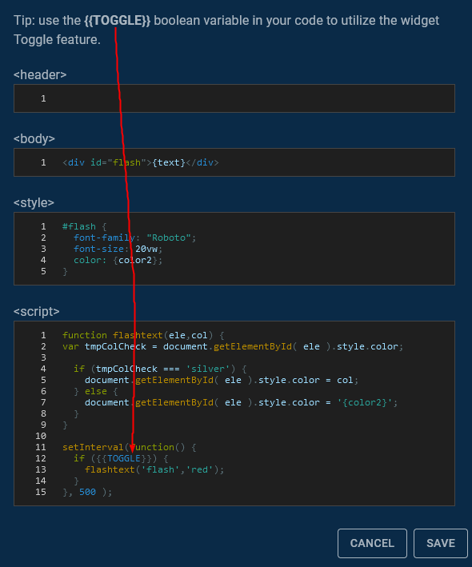
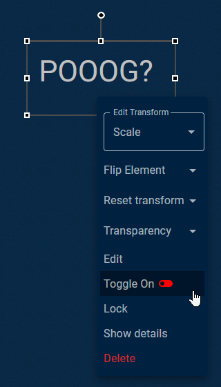

# Widget Element
## Summary
The Widget Element is one of the core canvas elements in Pogly, and the most feature-rich. Widget Elements are essentially mini-websites within Pogly, allowing for unlimited customization and creativity. 

## Details
Adding a new widget element may take a little practice, especially if you are not familiar with html & javascript. The leftmost menu in Pogly is called the Element Selection Menu. In this menu, you will see the "Widgets" dropdown menu.

Clicking "Add Widget" will result in a new modal appearing, allowing you to program your widget however you see fit. 

All the requirements to make a mini-website are present:
- \<header\> => This is the header section of a webpage, you can add script files, css files, etc.
- \<body\> => This is the body or contents of your webpage, you can add divs, paragraphs, links, images, etc.
- \<style\> => This is a built-in css stylesheet which you can add CSS directly to.
- \<script\> => The bread and butter, this allows you to enter javascript to program your widgets functionality.

Included with Pogly Standalone, there are three examples which showcase different widget features and can be used as a starting point if you wish to make your own widget. You can right click->edit the widget when it's on the canvas to peek at the source.

### Variables
Widget Variables allow you to easily substitute variable names in your widget code. Simply add a variable name, and its value. Then when you're writing your code, you can put the variable name in curly braces to make use of the variable. 

### Toggle
Widget Toggle allows you to toggle a boolean on or off via the widgets right click context menu.

To use the toggle feature, simply include `{{TOGGLE}}` in your code, in place of a boolean you wish to trigger.

When the widget is on the canvas, you can trigger the toggle via the right click context menu.

## Developer Details
Widgets are a great way for you to easily extend on Pogly without ever having to touch the source code. Because widgets by default are client-sided, creating something like an interactable button that does effects won't yield the results you're hoping for. 

You must develop your widgets with a deterministic mindset. Once a widget spawns, the widget should load and perform the same actions based on the same properties for all clients equally. To aide in that, the `{{TOGGLE}}` switch can be used to "trigger" widgets and it will sync the client-side state of those widgets when toggled.

Keep this client-side / deterministic nature in mind when making your widgets! 